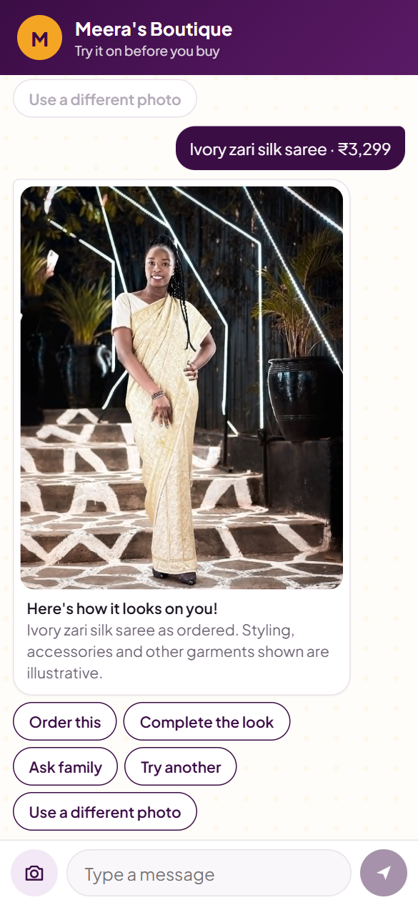
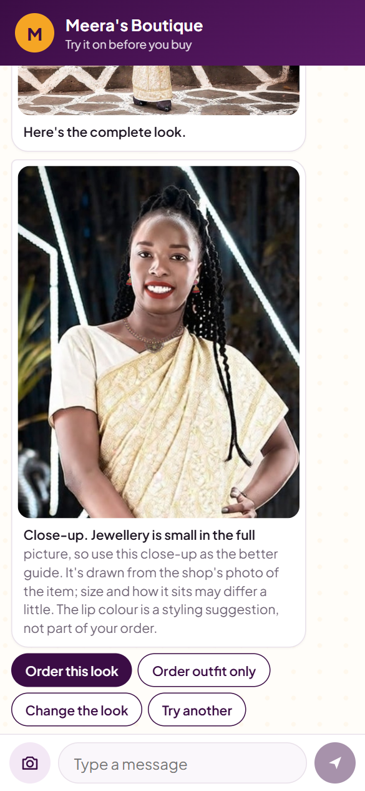
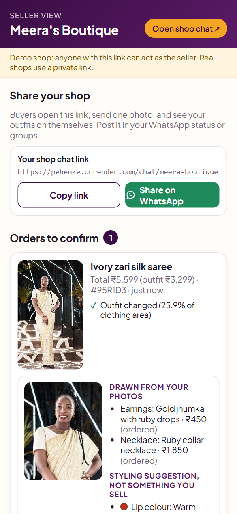
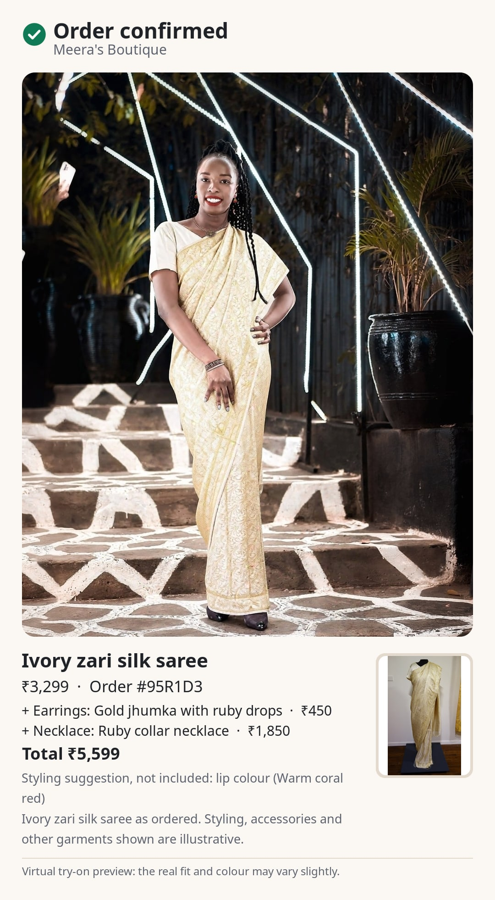
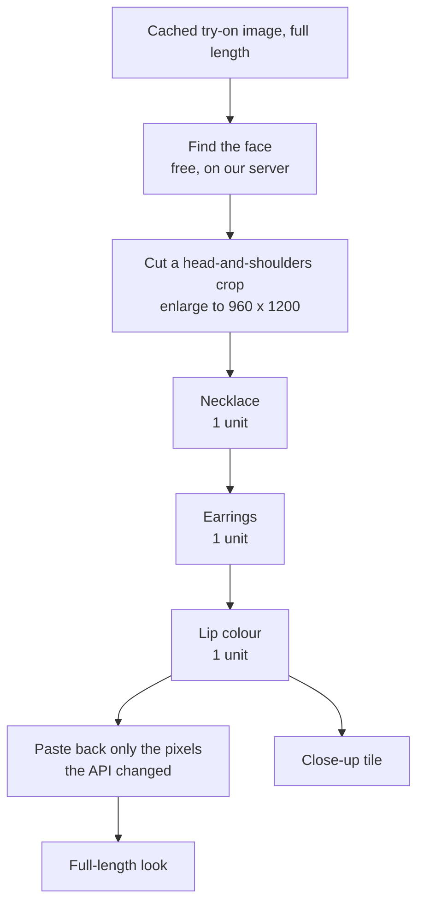

# PehenKe

PehenKe is a try-on assistant for small Indian clothing sellers who sell over chat and have no
website. The seller shares a chat link; a buyer opens it, sends one full-body photo and sees the
seller's outfit on themselves. If they order, that same image becomes the order confirmation card
("this is what you ordered, on you"), which the seller approves and can send on WhatsApp. The card
is designed to reduce refused cash-on-delivery orders; no seller has used it yet, so there are no
figures for that. It was built for the YouCam API Skin AI & eCommerce VTO Hackathon.

- Live demo: https://pehenke.onrender.com (a free instance: the first visit after a quiet spell
  takes about a minute to wake up)
- Image credits: https://pehenke.onrender.com/credits

What exists today is a web chat for buyers and a web page for sellers. There is no WhatsApp bot:
sellers share links and send cards through WhatsApp "click to chat" links, and the conversation
engine is written so a WhatsApp adapter can be added later. All text is in English.

| Try-on preview | Complete the look | Seller approval | Order card |
|---|---|---|---|
|  |  |  |  |

## Try it in 2 minutes

This path costs no YouCam units, because every image on it was rendered in advance and is served
from the cache. (Checked on the live site: the account balance was the same before and after.)

1. Open https://pehenke.onrender.com and tap **Try the demo**.
2. Tap **I agree**, then pick **Sample model B**.
3. Pick **Ivory zari silk saree**. The try-on preview appears.
4. Tap **Complete the look**, then choose **Gold jhumka with ruby drops**.
5. The chat shows a close-up and asks "Is your neck bare in this picture?" Tap **Yes, it's bare**,
   then choose **Ruby collar necklace**.
6. Choose the lip colour **Warm coral red**, then tap **Show me**. You get two images: the
   full-length look and a close-up.
7. Tap **Order this look**, then **Skip** (the WhatsApp number is optional).
8. Tap **Demo: open seller view**. Under "Orders to confirm", check the images and tap
   **Approve & send card**.
9. Back in the chat, the confirmation card arrives, with a link to the shareable card.

Other choices may render live and spend units: a try-on costs 2 and each look item costs 1. By
default the app is capped at 60 units a day in total, and at 6 new try-ons and 3 new looks per
visitor per day; anything already rendered is free. The try-ons of both sample models in all four demo outfits are
pre-rendered.

## YouCam APIs used

All calls are made server-side with `Authorization: Bearer <API key>`; the key never reaches the
browser. Paths are relative to `https://yce-api-01.makeupar.com`.

| Feature | Endpoints | Used for | Units per call |
|---|---|---|---|
| AI Clothes Virtual Try-On V3 | `POST /s2s/v2.0/file/cloth-v3`, `POST /s2s/v2.0/task/cloth-v3`, `GET /s2s/v2.0/task/cloth-v3/{task_id}` | The outfit on the buyer's photo | 2 per result |
| AI Makeup Virtual Try-On | `POST /s2s/v2.0/file/makeup-vto`, `POST /s2s/v2.0/task/makeup-vto`, `GET …/{task_id}` | The lip colour in a look | 1 per result |
| AI Necklace Virtual Try-On | `POST /s2s/v2.0/file/2d-vto/necklace`, `POST /s2s/v2.0/task/2d-vto/necklace`, `GET …/{task_id}` | The seller's necklace in a look | 1 per result |
| AI Earring Virtual Try-On | `POST /s2s/v2.0/file/2d-vto/earring`, `POST /s2s/v2.0/task/2d-vto/earring`, `GET …/{task_id}` | The seller's earrings in a look | 1 per result |
| Task delete | `POST /s2s/v2.0/task/delete` | Removing a buyer's images at YouCam when they delete their photos | not in the cost table |

Units are charged only when a task succeeds. For the three look features we saw this live:
refused and failed tasks cost nothing. Every try-on in testing succeeded, so for try-ons we rely
on YouCam's documentation, which also says a task that is started and never polled still
charges. Two more endpoints are called only by maintenance scripts, never by the app:
`GET /s2s/v2.0/credit/feature-cost` and `GET /s2s/v1.0/client/credit` (both free).

A typed client for AI Skin Tone Analysis exists in `lib/youcam/features/skinTone.ts`, but the
product does not call it and it has never been run (it costs 20 units per result).

## How the look pipeline works

The makeup, necklace and earring features reject a full-length picture ("no face detected"), so a
look is made on a head-and-shoulders crop of the finished try-on and then put back.



- **Finding the face** uses a small detector bundled with the app (pico, MIT licence). No API call.
- **Only the chosen steps run.** Each step is cached by a hash of everything before it, so a look
  that differs only in lip colour reuses the jewellery steps.
- **Crop sizes are multiples of 16.** The API changes odd sizes (a 959 x 1199 crop came back as
  960 x 1198), and a result of a different size no longer lines up with what was sent.
- **Smoothing is set to 0.** The makeup feature smooths skin by default; we switch that off so the
  buyer's face is not retouched. The lip shape is left as it is.
- **Paste-back changes only what the API changed.** The result is compared with the crop that was
  sent, and only the differing pixels (with a soft edge of a few pixels) go back into the
  full-length image. If more than 40% of the crop differs, the result is treated as misaligned
  and not pasted.
- **A refused item is left out.** If the API refuses the earrings or the necklace, the rest of the
  look is still made and the chat says which item was left out and why.
- **Earrings on one ear only are rejected.** That result is paid for but never shown, the unit is
  recorded as wasted, and the same combination is not rendered again.
- **Lip colours come from the outfit.** A local function reads the garment photo's main colours
  and proposes two shades. It does not know the buyer's skin tone.

Task ids are saved before polling, so a restart resumes a paid task without starting it again.

## The honesty layer

A wrong picture on an order card would cause the refusals the card is meant to prevent, so each
step limits what can be shown.

- **Seller photo gate.** Every outfit photo is checked once when it is added. Photos that are too
  small are rejected. If a Gemini API key is set and its daily limit is not used up, a vision
  check looks for glass, folds, cropping, held objects and extra layers. Otherwise the outfit
  stays hidden until the seller ticks a four-point checklist. Jewellery photos have their own
  free rules: one earring from the front (a pair photo gets a suggested crop to confirm), and a
  necklace laid in the U shape it has when worn, on a plain background.
- **Buyer photo.** It must be upright and large enough, and the buyer confirms it shows them head
  to toe. A photo sent before consent is not stored.
- **Three card verdicts.** The code defines `block`, `send_with_disclosure` and `send`. A render
  is blocked when the clothing area is almost unchanged (the buyer is told, and the units are
  recorded as wasted). Plain `send` requires a vision audit of the render that finds nothing
  added. The app does not run that audit on buyers' try-ons, so on the live site every card that
  is not blocked carries a disclosure.
- **Disclosure text.** The card says, for example, "Ivory zari silk saree as ordered. Styling,
  accessories and other garments shown are illustrative." and "Virtual try-on preview: the real
  fit and colour may vary slightly." A lip colour is listed as "Styling suggestion, not included".
- **The neck question.** A try-on sometimes draws jewellery that is not in the order, and we found
  no reliable free way to detect it at the neck. So before offering a necklace the chat shows the
  close-up and asks the buyer whether their neck is bare. On "No", no necklace is offered, and the
  answer is shown to the seller.
- **Earrings.** They are offered only when the try-on left the ears and forehead as they were in
  the buyer's own photo, and they are offered as an attempt ("I'll try to add them").
- **Items that could not be shown.** A left-out item is not part of the look order. The buyer can
  still add it, and the card and the seller's screen then mark it "(not shown)".
- **Seller approval.** No card reaches the buyer until the seller has looked at the image, the
  close-up and the disclosure line and approved it.
- **Consent.** Before any photo, the chat says the photo goes to YouCam, how long it is kept, and
  that sharing a card link or a family vote link is the buyer's choice.
- **Deletion.** "delete my photos" removes the buyer's photos, try-ons and looks from our database
  and asks YouCam to delete the matching tasks. It also removes the WhatsApp number, the card link
  and any family vote links. The order's item list is kept so the seller can ship it, and the
  chat says so. "stop" does the same and withdraws consent.
- **30-day retention.** Buyer photos and everything made from them are deleted automatically after
  30 days. Family vote links stop working after 7 days.

## What we measured

All figures are from [SPIKE.md](SPIKE.md). **Every test image is a licensed stock, museum or
Wikimedia Commons photo. No real seller or buyer has used PehenKe yet**, so these results may be
better than real phone photos will give.

Try-on (AI Clothes V3), 26 renders of 15 garments on 3 people:

- 26 of 26 API calls succeeded. Each cost 2 units; the balance changed by exactly 2 every time.
- Median time from task start to result: 16.1 seconds (11.0 to 88.6).
- The same inputs gave a byte-identical image five times, and every repeat was charged. This is
  why results are cached by content hash.
- By seller photo type, from visual review of 19 renders: mannequin 2 send, 2 disclose, 0 block;
  worn 3, 3, 1; flat-lay 0, 4, 0; hanger 2, 0, 2.
- Things the try-on added or got wrong: a blouse with every saree, jewellery in two renders,
  items carried over from the model in the seller's photo, swapped footwear (fixed by sending
  `change_shoes: false`), and three garments with the wrong construction.
- The automatic checks alone gave send 2, disclose 19, block 1, against 7, 12 and 3 by visual
  review. Pixel checks are not reliable enough to decide alone.
- The free-tier vision audit: 12 of 22 requests (55%) returned "high demand" errors, and the tier
  allowed 20 requests a day.

Complete the look:

- Lip colour, necklace and earrings all failed on the full-length image and worked on a
  head-and-shoulders crop. Failed calls were not charged.
- The face detector found exactly one face on all ten cached demo renders and none on a mannequin.
- Jewellery is drawn from the seller's photo as it is: a coiled chain was drawn coiled, and a pair
  of earrings on a shop card gave an unusable fragment.
- Lip colour at intensity 30, 40 and 50 painted #b7716d, #a75751 and #99433c against a proposed
  #b63420. The app uses 50.
- Pre-rendering looks for the 8 demo renders was planned at 17 units and cost 12. The API refused
  earrings on all four renders of one sample model (hair over the ears) and the necklace on both
  lehenga renders. One result had an earring on one ear only and was dropped. The demo has 7
  pre-rendered looks: 2 with jewellery and 5 with a lip colour only.

## Run it locally

Prerequisites: Node.js 22.12 or newer, below 25 (`.node-version` says 24), and npm.

Local mode needs no database, no API key and no units. It uses an in-process Postgres stored in
`.pglite/` and a fake renderer, so the images it produces are placeholders, not real try-ons. The
demo shop's photos are not in this repository, so local mode starts with no shop: you create one
and add your own photos.

```bash
npm install
cp .env.example .env                                  # leave every value empty for local mode
npm run seller:create:local -- --name "Test shop"     # prints a private seller link and a chat link
npm run dev:local                                     # http://localhost:3000
```

Then:

1. Open the printed seller link, tap **+ Add an outfit**, add a photo of a garment and a name.
   With no vision key it is marked "Needs your check": tick the four boxes and publish it.
2. Open the printed chat link, tap **I agree**, send a full-length photo of a person, confirm it,
   and pick the outfit.
3. Continue as in the demo: Complete the look, order, then approve on the seller page.

Run the seller command before starting the server, not while it is running: the local database
allows one process at a time.

Tests: `npm test` runs 210 tests in 22 files against an in-process database and a fake YouCam
API. They use no network and no units. `npm run typecheck` checks types.

Environment variables (names only; values go in `.env`, which is not committed):

| Variable | Purpose |
|---|---|
| `YOUCAM_API_KEY` | YouCam API key. Required except in local mode. |
| `YOUCAM_SECRET_KEY` | Optional. Only for the older token login, used as a fallback when reading the unit balance. |
| `YOUCAM_BASE_URL` | YouCam API server. Has a default. |
| `DATABASE_URL` | Postgres connection the app uses (for Neon, the pooled one). Required except in local mode. |
| `DIRECT_URL` | Direct Postgres connection, used for migrations. |
| `APP_URL` | Public address used in links sent on WhatsApp. |
| `ADMIN_SECRET` | Enables `/admin` for creating sellers. Without it, `/admin` does not exist. |
| `GEMINI_API_KEY` | Optional. Enables the vision check of seller garment photos. |
| `GEMINI_MODEL` | Optional model override for that check. |
| `GEMINI_DAILY_LIMIT` | Vision checks allowed per day (default 18). |
| `YOUCAM_DAILY_UNIT_CAP` | Units the whole app may spend per day (default 60). |
| `BUYER_DAILY_RENDERS` | New try-ons per buyer per day (default 6). |
| `BUYER_DAILY_LOOKS` | New looks per buyer per day (default 3). |
| `DB_STORAGE_LIMIT_MB` | Storage limit shown on the seller page (default 1024). |
| `SPIKE_UNIT_CAP` | Limit for the API test scripts in `scripts/spike` (default 300). |

With real services: set `YOUCAM_API_KEY`, `DATABASE_URL` and `DIRECT_URL`, run
`npm run db:migrate`, then `npm run dev`. `npm run db:seed` builds the demo shop, but it reads the
demo photos from `spike-assets/`, which are not in the repository; their sources are listed in
`spike-assets/SOURCES.md`.

## Deploy

See [DEPLOY.md](DEPLOY.md). It covers the Render free plan, how migrations run during the build
(the build fails if they cannot be applied), memory limits, and what `/api/health` reports.

## Limits and known issues

- **Not tested with real users.** Every result above is from stock, museum and Commons photos.
- **Jewellery is unreliable.** On the demo's 8 renders the API refused jewellery on 5, and one of
  the 3 it accepted came out wrong. It is small even in the close-up, and it is drawn exactly as
  it lies in the seller's photo, so the seller's photo has to be taken a specific way.
- **Earrings need visible ears.** We have no free way to tell beforehand whether an ear is
  visible. The API refuses when it cannot find one, which costs nothing, but the buyer has
  already been offered earrings.
- **The neck check is a question to the buyer**, not an automatic check.
- **The try-on adds things.** Blouses, jewellery and footwear that are not in the order can
  appear. The card discloses this in general terms; it does not list what was added.
- **Vision audit limits.** The seller photo check runs on Gemini's free tier, which allowed 20
  requests a day and often returned errors. Google may use free-tier inputs to improve its
  products, so buyer photos are never sent to it.
- **Pixel checks are weak signals.** The garment-length check is shown to the seller as
  information only.
- **Single instance.** The job queue, conversation locks and request pacing are in memory, so the
  app must run as one server process.
- **Free hosting.** The server sleeps after 15 minutes without traffic and takes about a minute to
  wake. Images are stored in the database, which has a 1 GB limit on the free plan.
- **Scope.** Lower-body garments sold on their own are not supported. Men's garments and cholis
  were weak in testing.

## Licence and image credits

Code: [MIT](LICENSE). Bundled files keep their own licences: the Noto Sans fonts in
`assets/fonts` (SIL Open Font License) and the face detection data in `assets/models` (MIT, from
the pico project).

The demo shop's photos are not in this repository. Each has its own licence (CC0, CC BY-SA or
public domain), listed with source and author in `spike-assets/SOURCES.md` and on the
[/credits](https://pehenke.onrender.com/credits) page.

The four screenshots in `docs/` show images derived from these Wikimedia Commons photos. They are
not covered by the MIT licence; they are shared under
[CC BY-SA 4.0](https://creativecommons.org/licenses/by-sa/4.0), as their sources require:

- Person: [Mercy Namukose](https://commons.wikimedia.org/wiki/File:Mercy_Namukose.jpg) by
  Mercynamukose, CC BY-SA 4.0. Changed: the clothing is replaced by a virtual try-on.
- Saree: [Sari, Varanasi, Textile Museum of Canada](https://commons.wikimedia.org/wiki/File:Sari,_Varanasi,_Uttar_Pradesh,_India,_1960s,_silk,_gold_thread,_satin_-_Textile_Museum_of_Canada_-_DSC00943.JPG)
  by Daderot, CC0.
- Earrings: [Gold Jhumka, dogra culture, Jammu](https://commons.wikimedia.org/wiki/File:Gold_Jhumka,_dogra_culture,_Jammu.jpg)
  by SpeakingArch, CC BY-SA 4.0. Changed: cropped to one earring and drawn on the person.
- Necklace: [Khalili Collection Islamic Art jly 1261.6](https://commons.wikimedia.org/wiki/File:Khalili_Collection_Islamic_Art_jly_1261.6.jpg)
  by Khalili Collections, CC BY-SA 3.0 IGO. Changed: drawn on the person.
